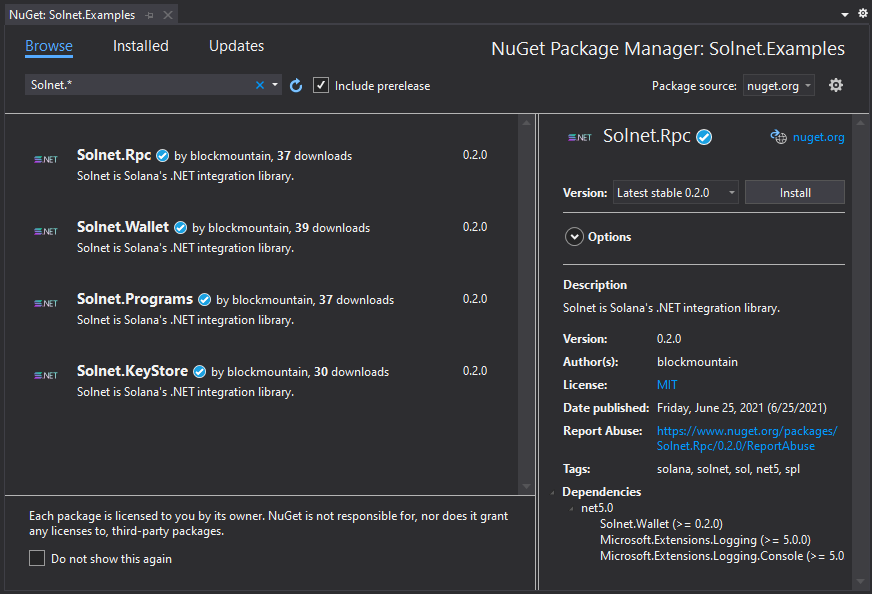

# Getting started with Solnet

## 1 - What is Solnet

Solnet is Solana's .NET integration library. It implements the entire solana JSON RPC API, both HTTP and WebSocket APIs. This allows any .NET developer to quickly integrate with the Solana ecosystem with very little work.
With the power of the .NET ecosystem and Solnet, anyone can quickly develop for Desktop, Web (ASP.NET, Blazor WebAssembly) and Mobile (MAUI, Xamarin, Avalonia), and integrate the powerful Solana ecosystem in a shared code base.
Given that we've achieve full coverage of the API, you can rest assured that the library own API won't have major breaking changes in the future.

### Features

- Full JSON RPC API coverage
- Full Streaming JSON RPC API coverage
- Wallet and accounts (sollet and solana-keygen compatible)
- Keystore (sollet and solana-keygen compatible)
- Programs
    - Native Programs
      - System Program
    - Solana Program Library (SPL)
      - Memo Program
      - Token Program
      - Associated Token Account Program
      - Name Service Program
      - Shared Memory Program

## 2- How to use

Before you start, we recommend you get acquainted with the [Solana Documentation](https://docs.solana.com/). The library implements the entire RPC API described [here](https://docs.solana.com/developing/clients/jsonrpc-api). While our entire documentation is based on this (we even made some contributions to the docs while developing Solnet), not everything can be deduced from our docs. Some terms and definitions might seem a bit foreign, hence our recomendation to get acquainted with the docs, and specially some of the [terms](https://docs.solana.com/terminology).

To get started using Solnet all you need is to have dotnet 5.0 installed.

Once you have created your dotnet project, all you need to do is either:

```
dotnet add Solnet.Rpc
```

Or if you're using Visual Studio, just open the NuGet package manager and search for Solnet and install the required packages.



Read more about the [package description](package_description.md) and the [hello world]() using Solnet and Solana.

## 3- Known issues

So far the library is being actively developed, but it is already very stable. Unfortunately, during our testing we found some issues regarding integration with Blazor WebAssembly. 
- The first issue, ends up being due to design decisions, you are restricted to the *Async functions, as the synchronous versions will throw a PlatforNotSupportedException.
- The second issue seems to be some sort of problem limited to blazor that we haven't been able to trace yet. When using WebSockets in the browser, the connection will be forcefully closed from the client side with an error 1006. This issue only occurs in the browser, has we've successfully tested the same code running in console apps for several hours.