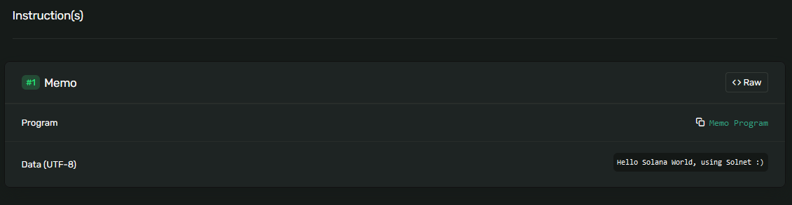

# Hello Solana World

In this article we're going to be diving step-by-step on how you can create an hello world using Solnet. In this specific example, you are to learn how to create a wallet, request an airdrop (testnet functionality), and transfer funds.

## 1- Creating project and linking dependencies

To start, we're going to create a new dotnet console project using:

```
dotnet new console
```

Now we have to add Solnet as a dependency to the project:

```
dotnet add package Solnet.Rpc
```

This will both add the Solnet.Rpc as a dependency to the created project, and restore the NuGet dependencies.

Now we're ready to dive into the code.

## 2- Creating a wallet

Now lets dive into the code. The first thing you want to do is create a new Wallet.
To do this, lets start by bringing into scope a couple namespaces related to the Wallets and their generation, and then create a Wallet from a Bip39 mnemonic.

```
using Solnet.Wallet;
using Solnet.Wallet.Bip39;
```

And then inside the main function:

```
Wallet wallet = new Wallet(WordCount.TwentyFour, WordList.English);

Console.WriteLine($"Mnemonic: {wallet.Mnemonic}");
Console.WriteLine($"PubKey: {wallet.Account.PublicKey.Key}");
Console.WriteLine($"PrivateKey: {wallet.Account.PrivateKey.Key}");
```

<strong>Note: always protect your private keys and Mnemonic!</strong>

<strong>Note2: every time you restart your program, this Wallet constructor will generate a new wallet, so save your keys (mnemonic) if you don't want to lose funds.</strong>

With this, you have successfully generated a new Wallet. If you had any existing wallet that you want to use, look into the Wallet [constructor overloads](../api/Solnet.Wallet.Wallet.yml).
Now that we have initialized a wallet, you have access to an Account, and possibly _infinite_ amounts of derivated accounts. With this, we can move on to make actual RPC requests.

## 3- Rpc Client

With the following code, we can initialize an <c>IRpcClient</c> that connects to the [TestNet](https://docs.solana.com/clusters). The ClientFactory class allows you to create both IRpcClient and IStreamingRpcClient objects and select from known public clusters or any private you have access to.

```
using Solnet.Rpc;
```
```
IRpcClient rpcClient = ClientFactory.GetClient(Cluster.TestNet);
```

The IRpcClient interface contains all the available JsonRpc methods in the solana API. Lets start with querying the balance of our generated wallet.

```
var balance = rpcClient.GetBalance(wallet.Account.PublicKey);

Console.WriteLine($"Balance: {balance.Result.Value}");
```

As you guessed, we just generated the account, so the balance is obviously 0.
To help during development tasks, there is a special RPC method [requestAirdrop](https://docs.solana.com/developing/clients/jsonrpc-api#requestairdrop) that is available in some clusters (DevNet and TestNet). Instead of spamming twitter and discord <i>airdrop wen</i> lets just request the test network for one :).

```
var transactionHash = rpcClient.RequestAirdrop(wallet.Account.PublicKey, 100_000_000);

Console.WriteLine($"TxHash: {transactionHash.Result}");
```

Some takeaways from the previous code:
- The request ammount sounds huge, be mindfull that 1 Sol = 1 Billion lamports. Both the balance and airdrop methods use lamports as units.
- The requestAirdrop request returns a transaction hash. Only after about 1 minute will the funds be available (depending on [commitment parameter](https://docs.solana.com/developing/clients/jsonrpc-api#configuring-state-commitment) levels)

The delay between the request transaction and its confirmation means we can't do requests straight away that depend on having funds. That brings us to the next part.

## 4- Streaming Rpc Client

To start using the `IStreamingRpcClient` is very similar to the `IRpcClient`, just need to call the `ClientFactory` to construct a new client. Be mindful that you use the same cluster, or the streaming client won't know about the transaction you just created in another cluster using the other client.

```
IStreamingRpcClient streamingRpcClient = ClientFactory.GetStreamingClient(Cluster.TestNet);

streamingRpcClient.ConnectAsync().Wait();
```

Now we are connected using WebSockets to the cluster and ready to subscribe to data changes. In this case, we'll subscribe to the transaction confirmation.

```
var subscription = streamingRpcClient.SubscribeSignature(transactionHash.Result, (sub, data) =>
{
    if(data.Value.Error == null)
    {
        var balance = rpcClient.GetBalance(wallet.Account.PublicKey);

        Console.WriteLine($"Balance: {balance.Result.Value}");
    }
    else
    {
        Console.WriteLine($"Transaction error: {data.Value.Error.Type}");
    }
});
```

With the streaming client, every method works the same. When you subscribe to any method, you receive a subscription state object (this object will allow you to unsubscribe at any time or to receive notifications about changes to the state of the subscription) and you need to pass an handle to a data handler method that receives a SubscriptionState and the data itself (with the `SubscriptionState` parameter, you can reuse your data handlers and still know which subscription triggered a given update).
Diving deeper into the example data handler, when you are notified its possible that there were errors with a given transaction, but if everything goes right, then the `Error` value should be null. And now requesting the balance should return the value requested.

Note: if your program keeps exiting before you receive the notification, add a `Console.ReadLine()` at the end of your program.

Given that we have balance on our wallet, we can now proceed to spend it. What could be better do than an actual "Hello World"? 

## 5- Programs

By now I hope you've read a bit about [Solana Programs](https://docs.solana.com/developing/on-chain-programs/overview). You don't need to understand it all, nor have to write rust to interact with them. But the gist of it, is that everything that happens inside the Solana blockchain is powered by some program. You want to transfer funds between two wallets? You call the [SystemProgram.Transfer](https://docs.rs/solana-sdk/1.7.3/solana_sdk/system_instruction/enum.SystemInstruction.html#variant.Transfer) method. You want to deal with tokens? Theres several programs and methods ready-to-use in the [SPL](https://spl.solana.com/token) waiting for you. For now, we're focusing on something very simple, we're going to use the [MemoProgram](https://spl.solana.com/memo) to simply print a log message.

To start, we need to add the Solnet.Programs package:

```
dotnet add package Solnet.Programs
```

This package contains the abstraction to call several native and SPL programs. Now lets not forget to bring the programs namespace into visibility.

```
using Solnet.Programs;
using Solnet.Rpc.Builders;
```

To call a program, we have to send a transaction using the `IRpcClient.SendTransaction` method. But for this we need to craft a transaction. The `TransactionBuilder` was created with this in mind. This builder abstracts all the logic regarding [transactions](https://docs.solana.com/developing/programming-model/transactions) (headers, signatures, public keys, etc) and allows you to craft a transaction using only 4 methods: Build, AddInstruction, SetFeePayer, SetRecentBlockHash. However, it is fully compliant with web3.js implementation, and you can craft a transaction using Solnet and sign it elsewhere after calling CompileMessage.
To sum things nicely, a transaction is a collection of instructions, each transaction needs someone to pay the fees, and to prevent the network to be spammed we need a (very) recent block hash.

The Solnet.Programs library, abstracts the usage of programs, and the creation of instructions that interact with these programs. For this example, we are using the static class `MemoProgram`.

Putting this together wew can quickly write:

```
var memoInstruction = MemoProgram.NewMemo(wallet.Account, "Hello Solana World, using Solnet :)");

var recentHash = rpcClient.GetRecentBlockHash();

var tx = new TransactionBuilder()
            .AddInstruction(memoInstruction)
            .SetFeePayer(wallet.Account)
            .SetRecentBlockHash(recentHash.Result.Value.Blockhash)
            .Build(wallet.Account);

var txHash = rpcClient.SendTransaction(tx);

Console.WriteLine($"TxHash: {txHash.Result}");
```

Now, if everything goes right, after a minute we can check that the transaction was confirmed and that the memo program executed our log.

To do this, you could either call the `IRpcClient.GetTransaction`, or you can double check outside of Solnet to make sure everything matches. Go to [Solana Explorer ](https://explorer.solana.com), select the TestNet and copy+paste the transaction hash.
You should be presented with all the details, and most important:



<strong>Congratulations, you just called your first on-chain Solana program :)</strong>

You can see the entire example on our [github](https://github.com/bmresearch/Solnet/blob/master/src/Solnet.Examples/HelloWorldExample.cs).

Next steps:
See more [examples](https://github.com/bmresearch/Solnet/blob/master/src/Solnet.Examples/).

Read the [API](../api/Solnet.Wallet.yml).